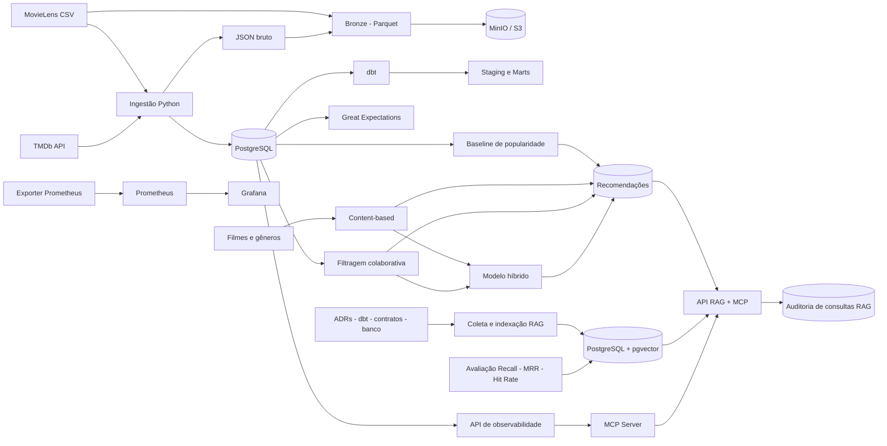

<div align="center">

# CineLake AI

[](https://github.com/CostaPaiiva/CineLake-AI/actions/workflows/ci.yml)
[](https://github.com/CostaPaiiva/CineLake-AI/actions/workflows/deploy.yml)

Plataforma de Engenharia de Dados, Recomendação e IA Agêntica de nível produção.

</div>

## Status

**Estado do repositório — 13/09/2026:** pipelines batch e streaming, recomendações, RAG, API com Redis, CI/CD, servidor de ferramentas por HTTP, infraestrutura como código e benchmarks implementados.

O projeto é um portfólio em evolução. A existência das configurações não significa que todos os serviços estejam saudáveis na VPS; os badges mostram o resultado dos workflows, e a saúde operacional deve ser conferida separadamente.

## O que é o CineLake AI?

O CineLake AI é uma plataforma completa de dados que utiliza dados reais de filmes para demonstrar:

- Engenharia e arquitetura de dados
- Processamento batch e streaming com Kafka
- Data Lake e Data Warehouse
- Modelagem dimensional
- Qualidade, contratos e linhagem de dados
- Orquestração e observabilidade
- Machine Learning e sistemas de recomendação
- MLOps com MLflow
- APIs, incluindo API principal com cache Redis
- RAG + MCP
- CI/CD com GitHub Actions
- Deploy automatizado via SSH
- Infraestrutura como código com Terraform e cloud-init para Hetzner Cloud
- Views analíticas para Power BI
- Benchmarks de formatos, índices, cache e ingestão

## Ambiente de desenvolvimento

A plataforma roda em uma única VPS Ubuntu. O PC local é usado para PowerShell/SSH, navegador e Power BI.

## Serviços Docker

| Serviço | Descrição | Porta (host) |
| --- | --- | --- |
| API | Aplicação principal | `127.0.0.1:8002` |
| PostgreSQL | Banco principal com pgvector | `127.0.0.1:5432` |
| MinIO | Armazenamento de objetos | `127.0.0.1:9000` |
| MLflow | Tracking server | `127.0.0.1:5000` |
| Redis | Cache em memória | `127.0.0.1:6379` |
| Kafka | Streaming de eventos | `127.0.0.1:9092` |
| ZooKeeper | Coordenação do Kafka | `127.0.0.1:2181` |
| Prometheus | Monitoramento | `127.0.0.1:9090` |
| Grafana | Dashboards | `127.0.0.1:3000` |
| Node Exporter | Métricas do host | `127.0.0.1:9100` |
| PostgreSQL Exporter | Métricas do banco | `127.0.0.1:9187` |

O MinIO utiliza `quay.io/minio/minio:latest`; o console fica em `127.0.0.1:9001`. Airflow não está definido no Compose: há uma DAG para uma instalação externa. O servidor de ferramentas HTTP também é iniciado separadamente, na porta `8010`.

## Configuração inicial

```bash
python3 -m venv .venv
source .venv/bin/activate
python -m pip install --upgrade pip
python -m pip install -e ".[dev]"
cp .env.example .env
```

## CI/CD

O projeto possui CI configurado no GitHub Actions:

- **Lint**: Ruff
- **Type check**: Mypy
- **Testes unitários**: Pytest com cobertura publicada como artefato
- **Testes de integração**: PostgreSQL e MinIO temporários
- **dbt**: compile + run + test contra PostgreSQL temporário
- **SQLFluff**: lint dos modelos com templater dbt e PostgreSQL temporário
- **Segurança**: pip-audit para dependências Python
- **Docker**: build da imagem e análise com Trivy

O CI roda em pushes para `main` e pull requests direcionados a `main`. O Deploy roda em pushes para `main` ou acionamento manual. Atualmente são workflows independentes: o Deploy não espera o CI passar.

### Deploy na VPS

O workflow publica a imagem `ghcr.io/costapaiiva/cinelake-ai` com tags `latest` e hash curto do commit. Depois conecta via SSH à VPS e executa `scripts/deploy.sh` em `~/CineLake-AI`. O script atualiza o repositório, baixa imagens, inicia os containers, aplica Alembic, executa dbt e verifica `/health` da API.

Configure os secrets `VPS_HOST`, `VPS_USER` e `VPS_SSH_KEY` no GitHub Actions. A chave pública correspondente deve estar autorizada na VPS; a chave privada fica no secret. Para imagens privadas, a VPS também precisa de autenticação no GHCR.

No fluxo normal, faça commit e push no PC e acompanhe **Actions → Deploy**. Não é necessário executar `git pull` nem reinstalar dependências manualmente na VPS: as dependências da API são instaladas no build Docker. A `.venv` só precisa ser atualizada quando for usada para executar comandos fora dos containers.

```bash
# Conferência na VPS após o deploy
docker compose ps
curl http://127.0.0.1:8002/health
docker compose logs --tail=100 api
```

O healthcheck da API informa seu status e a conexão Redis; não comprova a saúde de todos os serviços. Grafana e MLflow devem ser verificados pelos respectivos logs.

Há um script de rollback, mas ele ainda precisa de revisão: usa `CINELAKE_IMAGE_TAG`, enquanto o Compose fixa a API em `latest`, e interrompe os serviços com `docker compose down`. Não considere a restauração de versão garantida pela existência desse script.

> Atualização: o projeto também conta com API principal FastAPI, cache Redis e tracking de experimentos dos modelos com MLflow. Consulte a seção [API principal](#api-principal-e-mlflow).

## API principal e MLflow

A API principal é iniciada com:

```bash
python -m cinelake serve-main-api --host 127.0.0.1 --port 8002
```

Ela expõe `GET /health`, `GET /movies`, `GET /movies/{movie_id}`, `GET /movies/trending`, `GET /users/{user_id}/recommendations` e `POST /ratings`. A documentação Swagger fica em `http://127.0.0.1:8002/docs`.

Detalhes de filmes usam Redis como cache, com TTL de cinco minutos. Configure `REDIS_HOST` e `REDIS_PORT` no `.env`; o serviço é iniciado pelo Docker Compose.

O MLflow é iniciado pelo Compose em `http://127.0.0.1:5000`. Os recomendadores registram parâmetros, métricas e artefatos dos treinamentos e avaliações. PostgreSQL é usado como backend de tracking e MinIO como armazenamento de artefatos.

## Streaming de eventos com Kafka

O projeto agora possui um fluxo de eventos com Apache Kafka e ZooKeeper. O produtor gera eventos sintéticos de interação no tópico `movie-events`; o consumidor valida o schema, persiste eventos válidos em `event_log` e encaminha mensagens inválidas ou com falha de processamento para `movie-events-dlq`.

```bash
# Iniciar Kafka e ZooKeeper
docker compose up -d zookeeper kafka

# Produzir eventos sintéticos
python -m cinelake produce-events --quantidade 10

# Consumir, validar e persistir eventos
python -m cinelake consume-events --max-mensagens 100
```

O consumidor utiliza commit manual de offsets, grupo `cinelake-consumer` e gravação idempotente por `event_id`. Configure o broker pela variável `KAFKA_BOOTSTRAP_SERVERS` (padrão: `127.0.0.1:9092`). A migração `0007_create_event_log.py` cria a tabela de auditoria dos eventos.

### Plataforma de engenharia de dados para o domínio cinematográfico

_Ingestão confiável, Data Lake em camadas, qualidade de dados, modelagem analítica e interfaces para agentes de IA._

[Visão geral](#visão-geral) · [Início rápido](#início-rápido) · [Arquitetura](#arquitetura) · [Operação](#operação) · [Documentação](#documentação)

---

## Visão geral

O **CineLake AI** é um projeto de portfólio que constrói uma plataforma de dados end-to-end usando o catálogo do [MovieLens](https://grouplens.org/datasets/movielens/) e metadados do [TMDb](https://www.themoviedb.org/). O foco é demonstrar decisões de engenharia aplicáveis a um ambiente de produção: pipelines idempotentes, rastreabilidade de execuções, armazenamento em camadas, contratos de dados, modelo dimensional e observabilidade.

O ambiente-alvo é uma VPS Ubuntu. Os serviços de infraestrutura ficam isolados em Docker e suas portas são vinculadas a `127.0.0.1`; o acesso remoto é feito por túnel SSH.

> Estado atual: fundação de dados implementada — PostgreSQL com pgvector, ingestões MovieLens/TMDb, camada Bronze no MinIO, dbt, Great Expectations, observabilidade, servidor MCP, RAG auditável e recomendação por popularidade, conteúdo, filtragem colaborativa e modelo híbrido.

## Arquitetura



| Camada | Implementação atual |
| --- | --- |
| Fontes | MovieLens e TMDb |
| Ingestão | CLI Python, auditoria em `ingestion_batch` e reexecução idempotente |
| Persistência operacional | PostgreSQL 16 com pgvector + Alembic |
| Data Lake | MinIO compatível com S3, dados Bronze em Parquet |
| Transformação | dbt: staging e marts com esquema dimensional |
| Qualidade | Contrato de `ratings` e validação com Great Expectations |
| Recomendação | Popularidade, conteúdo, colaborativa e híbrida; persistência, API e avaliação offline |
| Observabilidade | API FastAPI, exporter Prometheus, Prometheus e Grafana |
| IA agêntica | API de ferramentas HTTP com Bearer token, auditoria e limite de requisições; integração local RAG+MCP |
| RAG | Coleta, embeddings, busca vetorial, avaliação e contexto para LLM |

## Principais capacidades

- Ingestão do MovieLens no PostgreSQL com `ON CONFLICT`: filmes e links são atualizados; ratings e tags não são duplicados.
- Ingestão incremental do TMDb com watermark persistido, limite de taxa, timeout e retentativas com backoff exponencial.
- Auditoria de cada execução com status, timestamps, volume processado e mensagem de erro.
- Conversão de CSV e JSON para Parquet e publicação na camada Bronze do MinIO.
- Modelos dbt para dimensões `dim_date`, `dim_movie`, `dim_user` e fato `fact_rating`.
- Contrato de dados para ratings — campos obrigatórios e faixa de nota entre `0.5` e `5.0`.
- Endpoints de saúde e freshness; métricas de pipeline compatíveis com Prometheus.
- Ferramentas MCP para saúde, execução de pipelines, qualidade, esquema e linhagem simplificada.
- Coleta de contexto para RAG a partir de ADRs, runbooks, contratos, modelos dbt e metadados operacionais.
- Indexação idempotente de documentos RAG no PostgreSQL/pgvector com embeddings de 384 dimensões.
- Endpoint `POST /ask` que combina busca vetorial e ferramenta MCP adequada ao contexto da pergunta.
- Auditoria de perguntas RAG, documentos recuperados, ferramentas acionadas, latência, erros e status HTTP.
- Avaliação da recuperação com Recall@k, MRR e Hit Rate@k, com resultado detalhado em JSON.
- Quatro estratégias de recomendação: popularidade, conteúdo por gêneros, colaborativa e híbrida.
- Persistência dos rankings por usuário, endpoints de consulta e avaliação offline comparativa.

## Stack

`Python` · `PostgreSQL + pgvector` · `Docker Compose` · `MinIO` · `Apache Parquet` · `SQLAlchemy` · `Alembic` · `dbt` · `Great Expectations` · `scikit-learn` · `scikit-surprise` · `FastAPI` · `Prometheus` · `Grafana` · `Sentence Transformers` · `Model Context Protocol`

## Pré-requisitos

- Python 3.10 ou superior
- Docker Engine com Docker Compose v2
- PostgreSQL, MinIO, Prometheus e Grafana são iniciados pelo Compose
- Uma chave de API do TMDb para a ingestão de metadados

## Início rápido

### 1. Preparar o ambiente

```bash
git clone https://github.com/CostaPaiiva/CineLake-AI.git
cd CineLake-AI

python -m venv .venv
source .venv/bin/activate        # Linux/macOS
# .venv\Scripts\Activate.ps1     # Windows PowerShell

python -m pip install --upgrade pip
python -m pip install -e ".[dev]"
cp .env.example .env
```

No Windows PowerShell, use `Copy-Item .env.example .env` em vez de `cp` caso necessário.

### 2. Configurar variáveis de ambiente

Edite o arquivo `.env`. Para uso local, os valores de `POSTGRES_HOST` e `MINIO_ENDPOINT` já apontam para `127.0.0.1`. Antes de executar a ingestão TMDb, defina uma chave válida:

```dotenv
TMDB_API_KEY=sua_chave_do_tmdb
```

Nunca envie o `.env` ao repositório. Ele contém credenciais e já está ignorado pelo Git.

### 3. Iniciar a infraestrutura e criar o schema

```bash
docker compose up -d
docker compose ps

alembic upgrade head
python -m cinelake check-db
```

### 4. Baixar e ingerir o MovieLens

```bash
mkdir -p data/raw/movielens
curl -L -o data/raw/movielens/ml-latest-small.zip \
  https://files.grouplens.org/datasets/movielens/ml-latest-small.zip
unzip data/raw/movielens/ml-latest-small.zip -d data/raw/movielens

python -m cinelake ingest-movielens
```

### 5. Enriquecer com TMDb e publicar a camada Bronze

```bash
# Teste com um lote pequeno
python -m cinelake ingest-tmdb --max-filmes 10

# Gera Parquet e envia para s3://data-lake/bronze/
python -m cinelake ingest-datalake-bronze
```

> A ingestão do TMDb depende de `links.tmdb_id`, preenchido pela ingestão anterior do MovieLens. O watermark permite continuar de onde a execução anterior parou.

### 6. Construir a camada analítica

```bash
cd dbt_project
dbt debug
dbt run
dbt test
```

### 7. Criar o índice de conhecimento RAG

```bash
cd ..

# Coleta contexto do repositório e do banco em JSON normalizado
python -m cinelake collect-rag-documents

# Gera embeddings e faz upsert em rag_documents (pgvector)
python -m cinelake index-rag-documents
```

Na primeira execução, o modelo `all-MiniLM-L6-v2` será baixado. As migrações aplicadas no passo 3 habilitam a extensão `vector` e criam as tabelas `rag_documents` e `rag_query_log`.

### 8. Gerar e avaliar recomendações

```bash
# Exibe os filmes com maior score de popularidade ponderada
python -m cinelake train-popularity-model

# Persiste recomendações globais para os usuários existentes
python -m cinelake generate-popular-recommendations --top-n 100

# Recomendação personalizada por gêneros
python -m cinelake train-content-based-model
python -m cinelake generate-content-recommendations --top-n 100

# Filtragem colaborativa item-item baseada nas avaliações
python -m cinelake train-collaborative-model
python -m cinelake generate-collaborative-recommendations --top-n 100

# Combina content-based e colaborativa
python -m cinelake generate-hybrid-recommendations \
  --top-n 100 --peso-content 0.4 --peso-collab 0.6

# Compara os modelos usando métricas offline
python -m cinelake evaluate-all-models --top-k 10
```

A tabela `recommendations` é criada pelas migrações do passo 3. O modelo de popularidade é global; os modelos content-based, colaborativo e híbrido são personalizados por usuário.

## Comandos da CLI

| Comando | Finalidade |
| --- | --- |
| `python -m cinelake check-db` | Verifica a conexão com PostgreSQL |
| `python -m cinelake ingest-movielens [--data-dir CAMINHO]` | Carrega os CSVs do MovieLens de forma idempotente |
| `python -m cinelake ingest-tmdb [--max-filmes N]` | Busca metadados incrementais no TMDb |
| `python -m cinelake ingest-datalake-bronze` | Converte dados brutos em Parquet e os envia ao MinIO |
| `python -m cinelake serve-observability` | Inicia a API FastAPI de observabilidade |
| `python -m cinelake run-metrics-exporter` | Inicia o endpoint Prometheus na porta 8000 |
| `python -m cinelake collect-rag-documents` | Coleta e normaliza documentos de contexto para RAG |
| `python -m cinelake index-rag-documents` | Gera embeddings e indexa documentos no pgvector |
| `python -m cinelake serve-rag-mcp` | Inicia a API que combina RAG e MCP na porta 8001 |
| `python -m cinelake evaluate-rag [--dataset CAMINHO] [--k N]` | Avalia a recuperação semântica do RAG |
| `python -m cinelake train-popularity-model` | Calcula e mostra o ranking de popularidade ponderada |
| `python -m cinelake generate-popular-recommendations [--top-n N]` | Gera e persiste recomendações populares |
| `python -m cinelake train-content-based-model` | Calcula similaridade item-item a partir dos gêneros |
| `python -m cinelake generate-content-recommendations [--top-n N]` | Gera recomendações personalizadas por conteúdo |
| `python -m cinelake train-collaborative-model` | Calcula similaridade item-item a partir das avaliações |
| `python -m cinelake generate-collaborative-recommendations [--top-n N]` | Gera recomendações colaborativas personalizadas |
| `python -m cinelake generate-hybrid-recommendations [--peso-content X] [--peso-collab Y]` | Combina os rankings content-based e colaborativo |
| `python -m cinelake evaluate-all-models [--top-k N]` | Compara os modelos de recomendação offline |
| `python -m cinelake serve-main-api` | Inicia a API principal na porta 8002 |
| `python -m cinelake produce-events --quantidade 10` | Publica eventos sintéticos no Kafka |
| `python -m cinelake consume-events --max-mensagens 10` | Consome e persiste eventos válidos |
| `python -m cinelake serve-mcp` | Inicia o servidor HTTP de ferramentas na porta 8010 |
| `python -m cinelake run-benchmarks` | Executa os benchmarks integrados ao runner |

## Operação

### Observabilidade

Há dois processos distintos que podem usar a porta `8000`. Execute **apenas um por vez**.

#### API de observabilidade

```bash
python -m cinelake serve-observability --host 127.0.0.1 --port 8000
curl http://127.0.0.1:8000/health
curl http://127.0.0.1:8000/metrics
curl http://127.0.0.1:8000/freshness
```

Os endpoints retornam JSON com conectividade, contagens de tabelas e freshness das fontes.

#### Exporter Prometheus

```bash
python -m cinelake run-metrics-exporter --port 8000
curl http://127.0.0.1:8000/metrics
```

Neste modo, `/metrics` retorna o formato de texto do Prometheus. O serviço `prometheus` do Compose coleta `host.docker.internal:8000`; portanto, o exporter precisa permanecer em execução na VPS. O Compose não inicializa esse processo Python automaticamente.

Prometheus e Grafana ficam disponíveis somente no host:

| Serviço | Porta na VPS | Acesso recomendado |
| --- | --- | --- |
| Grafana | `127.0.0.1:3000` | Túnel SSH |
| Prometheus | `127.0.0.1:9090` | Túnel SSH |
| MinIO Console | `127.0.0.1:9001` | Túnel SSH |

Exemplo de túnel para o Grafana:

```bash
ssh -L 3000:127.0.0.1:3000 <USUARIO>@<IP_DA_VPS>
```

Depois, abra `http://127.0.0.1:3000` no navegador local.

### Qualidade de dados

O contrato de `ratings` é definido em `src/cinelake/data_quality/data_contracts/ratings_contract.py`. A primeira configuração cria o datasource e a suíte de expectativas; em seguida, a validação consulta até mil registros de `ratings`.

```bash
python -c "from cinelake.data_quality.setup import configurar_ge; from cinelake.data_quality.validate import criar_data_context; configurar_ge(criar_data_context())"
python -c "from cinelake.data_quality.validate import validar_ratings; print(validar_ratings())"
```

Também existe a DAG `run_data_quality`, preparada para executar a validação diariamente em uma instalação externa do Apache Airflow.

### MCP Server

O módulo atual expõe ferramentas por uma API FastAPI HTTP. Trata-se de uma interface própria com `POST /tools/{tool_name}`, não de um transporte MCP padrão via `stdio` ou Streamable HTTP. As ferramentas permitem consultar:

- Saúde e freshness dos dados
- Histórico e detalhes de pipelines
- Falhas de qualidade
- Esquema e linhagem simplificada

```bash
python -m cinelake serve-mcp --host 127.0.0.1 --port 8010
```

Defina `MCP_TOKEN` no ambiente e envie `Authorization: Bearer <token>` nas chamadas às ferramentas. O corpo recebe `{"argumentos": {}}`. O servidor tem `GET /health` sem autenticação, limite em memória de 60 chamadas por minuto por nome de token e auditoria em `mcp_audit_log` (migração 0008). O limite não é compartilhado entre processos. Use túnel SSH para acesso remoto ao endereço local.

### Power BI

O script `scripts/create_powerbi_views.sql` cria as views `mart_powerbi_executive_overview`, `mart_powerbi_recommendation_analytics` e `mart_powerbi_data_engineering_monitoring`. `scripts/populate_model_metrics.py` popula as métricas de modelos.

```bash
# Na VPS, com o banco e as tabelas de origem disponíveis
docker exec -i cinelake-postgres psql -v ON_ERROR_STOP=1 -U cinelake -d cinelake < scripts/create_powerbi_views.sql
```

No PowerShell do PC, mantenha aberto um túnel SSH:

```powershell
ssh -N -L 15432:127.0.0.1:5432 USUARIO@IP_DA_VPS
```

No conector PostgreSQL do Power BI, informe servidor `localhost:15432`, banco `cinelake` e as credenciais do banco.

### Infraestrutura como código

`infrastructure/terraform/` contém configuração para uma **nova VPS na Hetzner Cloud**, chave SSH, firewall e bootstrap com cloud-init. Ela não gerencia automaticamente a VPS Contabo existente. O código requer Terraform >= 1.5 e o provider `hetznercloud/hcloud`.

```bash
cd infrastructure/terraform
terraform init
terraform validate
```

Use `terraform.tfvars.example` como referência para token, servidor, localização, chave pública e CIDR SSH. Antes de provisionar, revise `terraform plan`: aplicar essa configuração cria recursos na Hetzner e pode gerar cobrança. O backend remoto está apenas comentado como exemplo; não há estado remoto configurado por padrão.

### Benchmarks

```bash
python -m cinelake run-benchmarks
```

O runner compara CSV/Parquet, consultas com/sem índice, Redis/consulta direta e ingestão full/incremental. Salva os resultados em `docs/benchmarks/resultados.json` e tenta registrar métricas no experimento `benchmarks` do MLflow. Requer dados MovieLens locais, PostgreSQL e Redis conforme o cenário.

Há também um módulo de partition pruning, ainda não integrado ao runner. Os resultados Markdown são um template sem medições preenchidas; não representam ganhos comprovados. Execute benchmarks em uma base de testes, pois os cenários de índice e ingestão podem alterar o banco.

### RAG + MCP API

O módulo `cinelake.rag` coleta ADRs, runbooks, modelos e schemas dbt, contratos de dados, esquema do PostgreSQL e o histórico de pipelines. Os documentos são normalizados em JSON, vetorizados pelo modelo `all-MiniLM-L6-v2` e indexados com upsert idempotente em `rag_documents`.

Inicie a API RAG+MCP:

```bash
python -m cinelake serve-rag-mcp --host 127.0.0.1 --port 8001
```

Envie uma pergunta:

```bash
curl -X POST http://127.0.0.1:8001/ask \
  -H "Content-Type: application/json" \
  -d '{"texto":"Qual é o status da plataforma?", "top_k": 5}'
```

O endpoint recupera documentos semanticamente similares e seleciona, quando aplicável, uma ferramenta MCP local para obter contexto operacional atual. A resposta devolve o contexto estruturado; a geração final por um LLM ainda não é implementada.

Cada requisição é registrada em `rag_query_log`, incluindo documentos recuperados, ferramenta MCP, latência, status e possível erro. Consulte as métricas agregadas e as dez últimas consultas:

```bash
curl http://127.0.0.1:8001/rag/metrics
```

O mesmo serviço expõe recomendações globais, personalizadas e rankings persistidos:

```bash
curl "http://127.0.0.1:8001/recommendations/popular?top_n=10"
curl "http://127.0.0.1:8001/recommendations/user/1?modelo=hybrid&top_n=10"
curl "http://127.0.0.1:8001/recommendations/model/content_based?user_id=1&top_n=10"
```

### Avaliação do RAG

O comando de avaliação recebe um dataset JSON com a chave `perguntas`; cada item deve conter `id`, `texto` e `documentos_relevantes` (títulos esperados). Ele calcula Recall@k, MRR e Hit Rate@k, registra a execução em `ingestion_batch` e salva o detalhamento em `data/rag/evaluation/results.json`.

```bash
python -m cinelake evaluate-rag \
  --dataset data/rag/evaluation/eval_dataset.json \
  --k 5
```

### Sistema de recomendação

O CineLake AI possui quatro estratégias:

- **Popularidade:** ranking global com média ponderada.
- **Content-based:** recomenda filmes semelhantes aos que o usuário avaliou positivamente, com base em gêneros.
- **Colaborativa:** usa padrões de avaliações para recomendar itens similares aos já consumidos pelo usuário.
- **Híbrida:** normaliza e combina os scores content-based e colaborativo; os pesos padrão são `0.4` e `0.6`, respectivamente.

As recomendações são persistidas por modelo em `recommendations`. A avaliação usa divisão temporal dos ratings e mede Precision@k, Recall@k e Hit Rate. O comando `evaluate-all-models` compara as estratégias disponíveis.

#### Baseline por popularidade

O baseline usa a fórmula de popularidade ponderada do IMDb:

```text
(v / (v + m)) × R + (m / (v + m)) × C
```

Onde `v` é o número de avaliações do filme, `R` é sua nota média, `m` é o mínimo de votos configurado e `C` é a média global.

## Testes e qualidade de código

```bash
# Testes unitários e de integração (requerem infraestrutura ativa para os marcados como integration)
pytest

# Apenas testes unitários
pytest -m "not integration"

ruff check .
ruff format --check .
mypy src
```

## Estrutura do repositório

```text
.
├── airflow/                 # DAGs de orquestração
├── alembic/                 # Migrações do PostgreSQL
├── dbt_project/             # Modelos staging e marts
├── docs/                    # Guia operacional e ADRs
├── infrastructure/          # Configuração de Prometheus e Grafana
│   └── terraform/           # Hetzner Cloud, firewall e cloud-init
├── scripts/                 # Deploy, rollback, CI e views Power BI
├── src/cinelake/
│   ├── ingestion/           # MovieLens e TMDb
│   ├── datalake/            # Bronze e cliente MinIO
│   ├── data_quality/        # Contratos e Great Expectations
│   ├── observability/       # API, health e métricas
│   ├── benchmarks/          # Experimentos de desempenho
│   ├── mlops/               # Tracking MLflow
│   ├── streaming/           # Kafka, validação e DLQ
│   ├── mcp_server/          # Servidor e ferramentas MCP
│   ├── rag/                 # Coleta, recuperação, avaliação e observabilidade RAG
│   ├── recommender/          # Popularidade, conteúdo, colaborativa, híbrida e avaliação
│   └── api/                 # API RAG + MCP
└── tests/                   # Testes unitários e de integração
```

## Documentação

- [Guia operacional](docs/GUIA_OPERACIONAL.md)
- [Benchmarks e metodologia](docs/benchmarks/README.md)
- [Template de resultados](docs/benchmarks/resultados.md)
- [Configuração Terraform](infrastructure/terraform/main.tf)
- [ADR-001 — Desenvolvimento em VPS remota](docs/adr/ADR-001-remote-vps-development.md)
- [ADR-002 — RAG e MCP como camada de IA](docs/adr/ADR-002-rag-mcp-as-ai-layer.md)
- [ADR-003 — Infraestrutura PostgreSQL em Docker](docs/adr/ADR-003-docker-postgresql-infra.md)
- [ADR-004 — Ingestão idempotente](docs/adr/ADR-004-ingestion-pipeline-idempotency.md)

## Próximos passos

- Supervisionar os processos ainda externos ao Compose, incluindo o servidor de ferramentas HTTP.
- Evoluir a orquestração do Airflow para os pipelines de ingestão e transformação.
- Condicionar o deploy ao sucesso do CI e revisar rollback e versionamento efetivo das imagens.
- Evoluir o tracking MLflow com versionamento de modelos e retreinamento automatizado.
- Registrar resultados reproduzíveis de benchmarks e integrar partition pruning ao runner.
- Integrar um provedor LLM para transformar o contexto RAG+MCP em respostas finais.
- Ampliar o dataset de avaliação e adicionar métricas de relevância e segurança ao fluxo RAG.
- Gerar linhagem automaticamente a partir dos artefatos do dbt.

## Licença

Este projeto é distribuído sob a [Apache License 2.0](LICENSE).

Copyright 2026 CineLake AI Contributors.

O código do projeto e os dados/serviços de terceiros utilizados pela plataforma podem estar sujeitos a licenças e termos próprios. Consulte as condições do MovieLens, TMDb, modelos de embeddings e dependências antes de redistribuir esses componentes.
