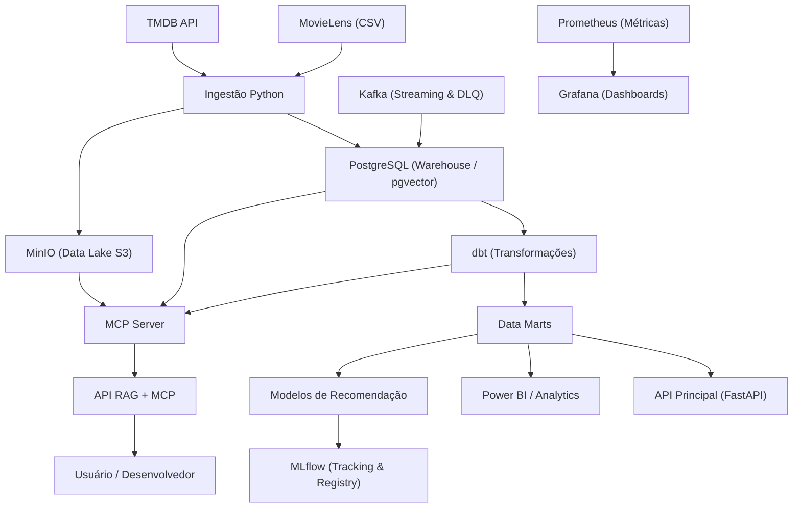

# Arquitetura Geral — CineLake AI

O CineLake AI é uma plataforma de engenharia de dados de ponta a ponta, cobrindo ingestão, armazenamento, transformação, qualidade, machine learning, APIs e IA assistida por RAG + MCP.

## Camadas

1. **Ingestão**: MovieLens (CSV), TMDB (API), eventos (Kafka).
2. **Armazenamento**: PostgreSQL (warehouse), MinIO (data lake).
3. **Transformação**: dbt (staging, marts).
4. **Qualidade**: Great Expectations, testes dbt, contratos de dados.
5. **Orquestração**: Airflow.
6. **Machine Learning**: modelos de recomendação (baseline, content-based, collaborative, hybrid).
7. **MLOps**: MLflow (tracking, model registry).
8. **APIs**: FastAPI (principal + RAG/MCP).
9. **IA**: RAG (pgvector) + MCP remoto.
10. **Observabilidade**: Prometheus, Grafana, logs estruturados.
11. **Streaming**: Kafka com DLQ.
12. **Infraestrutura**: Docker Compose, Terraform.
13. **CI/CD**: GitHub Actions (CI + Deploy + Rollback).
14. **Segurança**: UFW, fail2ban, Nginx + Let's Encrypt.

## Diagrama de Arquitetura

